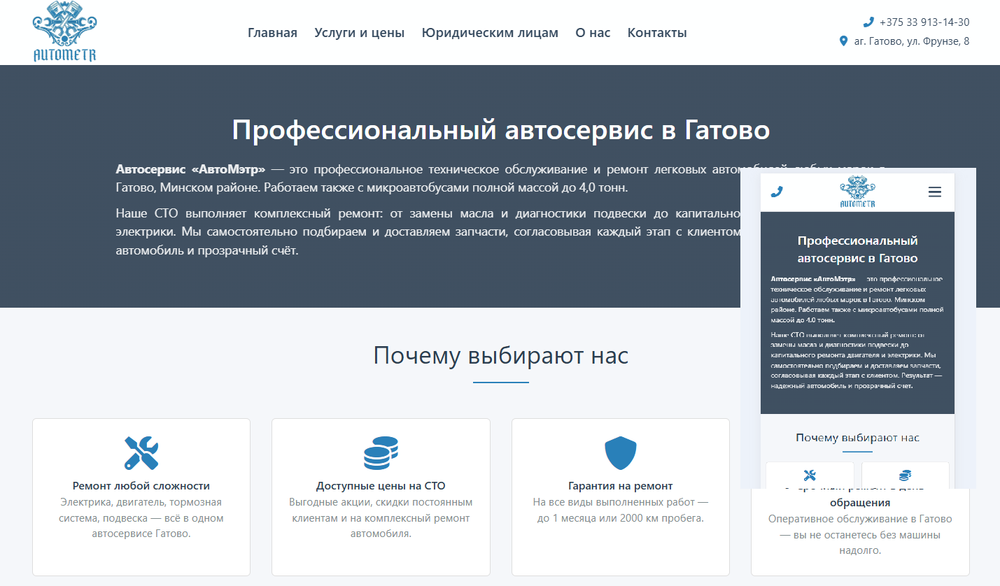

# 🚗 АвтоМэтр — сайт автосервиса в Гатово

Многостраничный адаптивный сайт для автосервиса «АвтоМэтр» (аг. Гатово, Минский район, Беларусь).  
Проект создан для представления услуг, цен, информации о компании и контактов.  
Подходит для размещения на любом статическом хостинге.

 <!-- Если есть скриншот, можно добавить -->

## 🔧 Особенности

- **Адаптивный дизайн** — корректно отображается на мобильных, планшетах и десктопах.
- **Sticky‑шапка** без рывков при прокрутке.
- **Бургер‑меню** на мобильных устройствах с плавной анимацией.
- **Яндекс.Карта** с меткой автосервиса на странице контактов.
- **SEO‑оптимизированные тексты** (ключевые слова, мета‑теги, alt‑атрибуты).
- **Простая форма записи** (пока без реальной отправки, можно подключить).
- **Иконки Font Awesome** для визуального оформления.
- **Content Security Policy** для безопасности (с возможностью гибкой настройки).

## 📁 Структура проекта
avtometr/
├── index.html # Главная страница
├── services.html # Услуги и цены
├── legal_entities.html # Юридическим лицам
├── about.html # О компании
├── contact.html # Контакты и карта
├── css/
│ └── styles.css # Основной файл стилей
├── js/
│ ├── scroll.js # Плавный скролл к якорям
│ ├── map.js # Инициализация Яндекс.Карты
│ └── menu.js # Логика бургер‑меню
├── images/
│ ├── Logo.png # Логотип
│ ├── price/ # Иллюстрации услуг
│ ├── otziv/ # Фото отзывов
│ └── photo/ # Фото сервиса
└── robots.txt # Правила для поисковых роботов

## 🛠 Используемые технологии

- HTML5
- CSS3 (Flexbox, CSS Grid, медиазапросы, анимации)
- JavaScript (ES6, без фреймворков)
- [Яндекс.Карты API 2.1](https://yandex.ru/dev/maps/)
- [Font Awesome 6](https://fontawesome.com/) (CDN)

## 🚀 Быстрый старт

1. Склонируйте репозиторий или скачайте архив.
2. Откройте файл `index.html` в любом современном браузере — сайт готов к просмотру.
3. Для публикации загрузите содержимое на любой хостинг статических файлов (GitHub Pages, Netlify, хостинг с поддержкой HTML).

## 🗺 Настройка Яндекс.Карты

По умолчанию карта использует демонстрационный API‑ключ, который может быть неактивен.  
Чтобы карта заработала корректно, получите бесплатный ключ:

1. Перейдите в [Кабинет разработчика Яндекс](https://developer.tech.yandex.ru/).
2. Создайте ключ для сервиса **JavaScript API и HTTP Геокодер**.
3. В каждом HTML‑файле, где подключается карта, замените значение параметра `apikey`:
   ```html
   <script src="https://api-maps.yandex.ru/2.1/?apikey=ВАШ_КЛЮЧ&lang=ru_RU" type="text/javascript"></script>